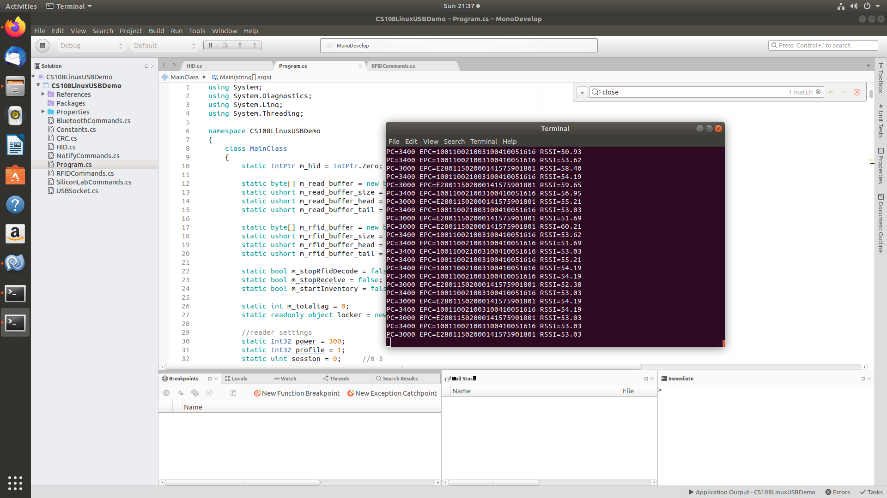

# CS108 Linux USB Demo App 

This demo app is based on C# that can be run under Linux terminal.  As the tool required is based on the GCC tool chain and Mono runtime, you can run the same on other platforms including MacOS and Windows

## Compile the HID-UART API Library on your Linux Host

This will generate the `libslabhiddevice.so` file so that the C# code will be invoking this library for communicating with the CS108.

Please look under the `USBDriver` folder and you can find the source code and instruction for building from source.

* Install dependencies (Ubuntu)
```
$ sudo apt-get install libusb-1.0-0-dev g++
``` 
* Build the library
```
$ make 
```
* Install library to /usr/lib (default reference path by Mono runtime)
```
$ sudo make install INSTALLPATH=/usr
```
* Copy the file SiliconLabs.rules under `USBDriver/slabhiddevice/doc` to `/etc/udev/rules.d` 

This allows libusb-1.0 to have read/write access to the device

## Install Mono Runtime on Linux

* Install the complete runtime and libraries (Ubuntu)
```
$ sudo apt install mono-devel
```

## Build and Run the Demo App

You can open the solution with MonoDevelop IDE, where you can build the project.  At the same time, you can use `msc` at the terminal that comes with Mono to build the code.  




